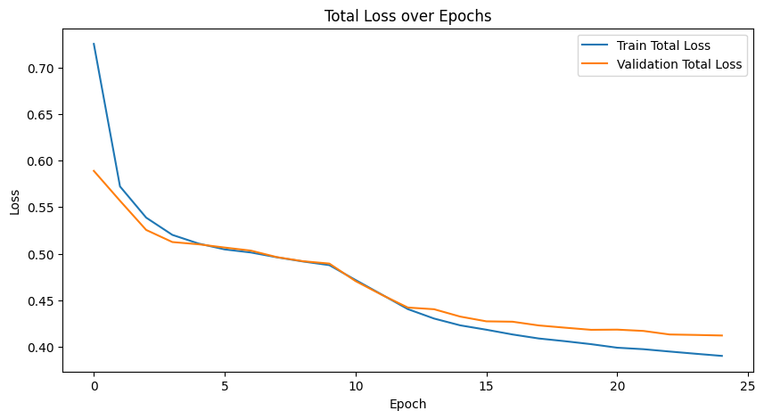
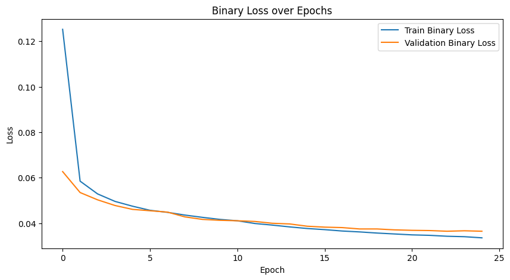
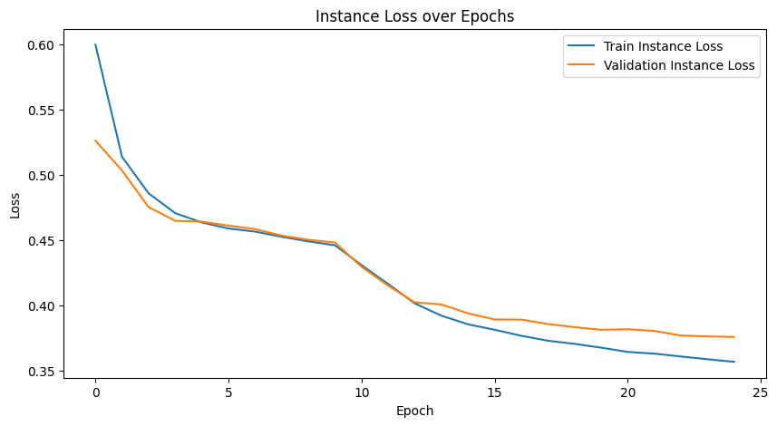
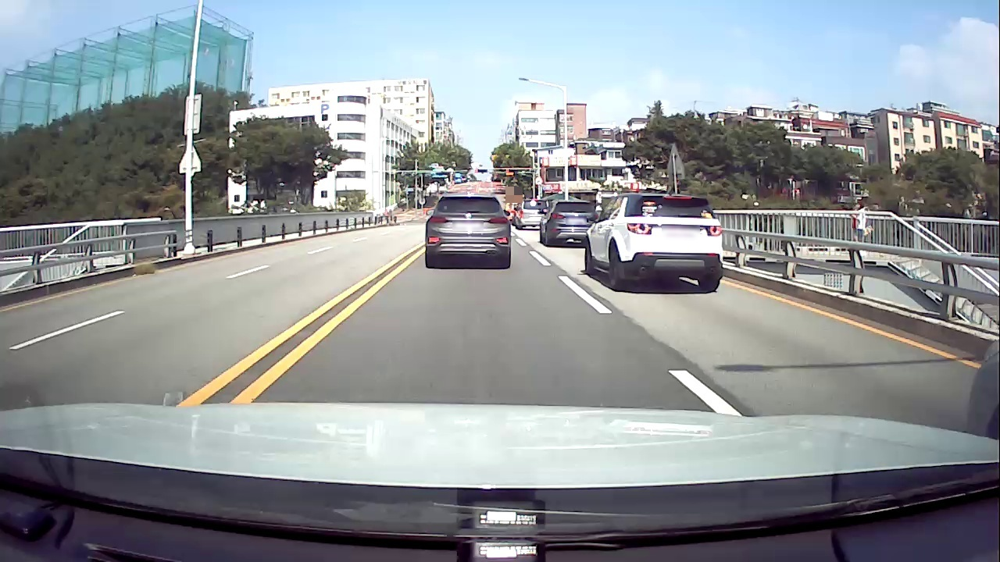
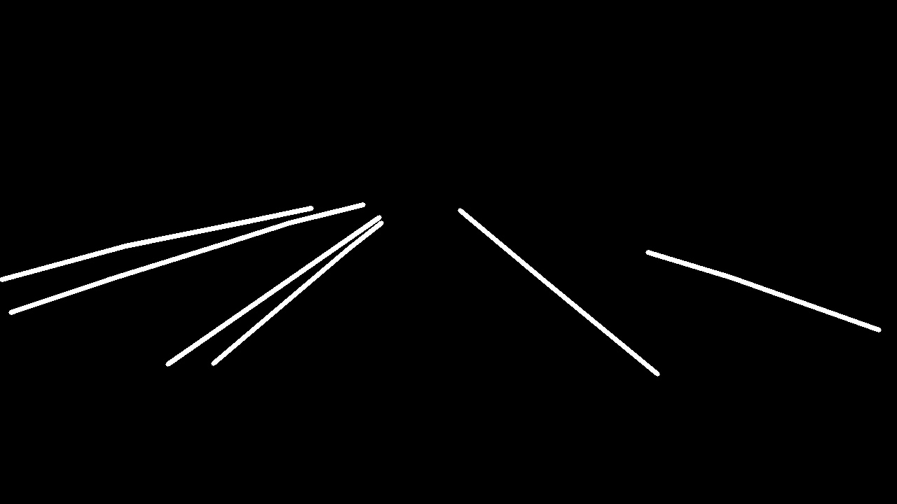
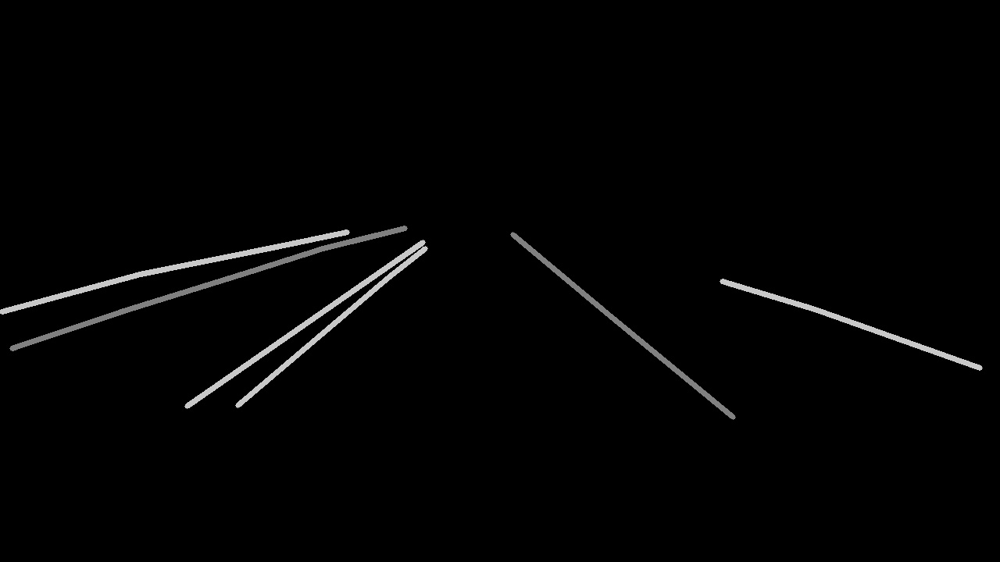
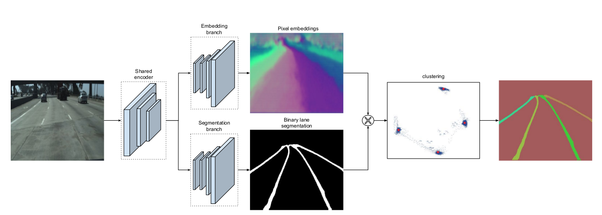
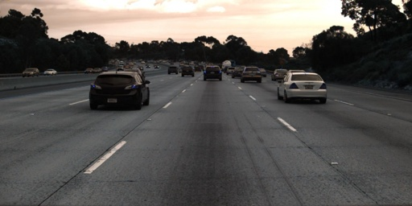
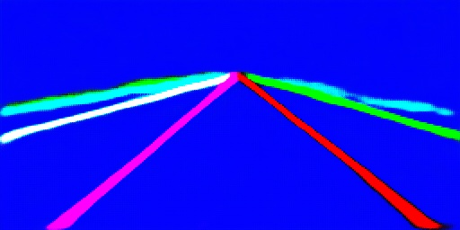

# Lane-Detection
This repository contains the codebase for the Lane Detection component of our Driving Guidance Project.


## Getting Started
Clone this repository:  
``` 
git clone https://github.com/lunash0/prometheus5_project_AIDrivingGuide 
```

## Dataset
We fine-tuned a pretrained model using the [AI-HUB dataset](https://www.aihub.or.kr/aihubdata/data/view.do?currMenu=115&topMenu=100&dataSetSn=197).
 Specifically, we used the c_1280_720_daylight_train_1(images)and c_1280_720_daylight_train_1(labels) datasets. 
- Number of training samples: 8000
- Number of test samples: 2000

## Training models
We provided a script in `train.py`, for training with various configurations provided in the lane-detection model. You may use it as a reference to write your own training script.

The environment for training and evaluation:  
```
python=3.6
torch>=1.2
numpy=1.7
torchvision>=0.4.0
matplotlib
opencv-python
pandas
```

1. **Run Training Script**:
   Execute the following command to start training:
    ```
    !python /content/drive/MyDrive/lanenet-lane-detection-pytorch/train.py --dataset /content/drive/MyDrive/dataset_10k --pretrained /content/drive/MyDrive/lanenet-lane-detection-pytorch/model_weight/existing/best_model.pth
    ```
    We use an existing pretrained model to fine-tune the lane detection model. The pretrained model's weights were initialized from the following path: `model_weight/existing/best_model.pth`


## Inference
1. **Run Testing Script**:
   Execute the following command to start testing images:
   ```
   !python test.py --img ./data/tusimple_test_image/0.jpg
    ```
   Execute the following command to start testing your video file:

    ```
    !python test_video.py --video /your_video_path --height 480 --width 640 --model /content/lanenet-lane-detection-pytorch/log/best_model.pth --model_type ENet 
    ```

## Results
### 1) Training and Validation Logs
We tracked the loss over epochs for both the training and validation datasets. The following graphs illustrate the performance of the model across three different loss metrics: Total Loss, Binary Loss, and Instance Loss.

1. Total Loss over Epochs 

    


2. Binary Loss over Epochs 

    
3. Instance Loss over Epochs 

    


### 2) Testing On Image

<div style="display: flex; justify-content: space-around;">
    <div>
        <p>- Binary</p>
        
    </div>
    <div>
        <p>- Binary</p>
        
    </div>
    <div>
        <p>Instance</p>
        
    </div>
</div>


### 3) Testing On Real-time video
We used `ENet` as our model for the best validation. <br>
We have used the `train_video.py` script to test the model on a video. <br> You can see video in `./results/result_testvideo2.mp4`


## Configurations Structure
```
train:
  batch_size              
  seed                      
  image_size
  learning_rate
  optimizer
  epochs
  model_name: lanenet           
  loss_type: 
  device: 
  early_stop: 
  early_stop_patience
  save_path
  dataset_path

log:
  project: 
  entity: 

test:
  input_video_path: 
  binary: 
  instance: 

  
```

## Directory Structure
```
Lane-Detection/
│
├── data/
│ ├── source_image/ 
| |── training_data_example/
│ └── ...
│
├── dataloader/
│ ├── __init__.py
| |── data_loaders.py
│ └── ...
|
├── log/
│ ├── best_model.pth
| |── data_loaders.py
│ └── ...
│
├── model/
│ ├── lanenet/
│ ├── utils/
│ ├── __init__.py
│ └── ... 
|
├── model_weight/
│ ├── existing/
│ └── ... 
│
├── results/
│ ├── TotalLoss_Epochs.png 
│ ├── BinaryLoss_Epochs.png 
│ └── ... 
│
├── README.md 
├── eval.py 
├── train.py
├── test.py 
├── test_video.py 
├── tuisimple_transform.py 
| 
```

> Lane-Detection task is done by [Wooju Kwon](https://github.com/woojump) and [Yaeji Kim](https://github.com/jyhannakim). 

<br>


# License - Lanenet-Lane-Detection (pytorch version)
  
[中文版](https://github.com/IrohXu/lanenet-lane-detection-pytorch/blob/main/CHINESE_README.md)  

## Introduction   
Use pytorch to implement a Deep Neural Network for real time lane detection mainly based on the IEEE IV conference paper "Towards End-to-End Lane Detection: an Instance Segmentation Approach".You can refer to their paper for details https://arxiv.org/abs/1802.05591. This model consists of ENet encoder, ENet decoder for binary semantic segmentation and ENet decoder for instance semantic segmentation using discriminative loss function.  

The main network architecture is:  


## Generate Tusimple training set/validation set/test tet   
First, download tusimple dataset [here](https://github.com/TuSimple/tusimple-benchmark/issues/3).  
Then, run the following command to generate the training/ val/ test samples and the train.txt/ val.txt/ test.txt file.   
Generate training set:  
```
python tusimple_transform.py --src_dir path/to/your/unzipped/file --val False
```
Generate training/ val set:  
```
python tusimple_transform.py --src_dir path/to/your/unzipped/file --val True
```
Generate training/ val/ test set:  
```
python tusimple_transform.py --src_dir path/to/your/unzipped/file --val True --test True
```
path/to/your/unzipped/file should like this:  
```
|--dataset
|----clips
|----label_data_0313.json
|----label_data_0531.json
|----label_data_0601.json
|----test_label.json
```  

## Training the model    
The environment for training and evaluation:  
```
python=3.6
torch>=1.2
numpy=1.7
torchvision>=0.4.0
matplotlib
opencv-python
pandas
```
Using example folder with ENet:   
```
python train.py --dataset ./data/training_data_example
```
Using tusimple folder with ENet/Focal loss:   
```
python train.py --dataset path/to/tusimpledataset/training
```
Using tusimple folder with ENet/Cross Entropy loss:   
```
python train.py --dataset path/to/tusimpledataset/training --loss_type CrossEntropyLoss
```
Using tusimple folder with DeepLabv3+:   
```
python train.py --dataset path/to/tusimpledataset/training --model_type DeepLabv3+
```    

If you want to change focal loss to cross entropy loss, do not forget to adjust the hyper-parameter of instance loss and binary loss in ./model/lanenet/train_lanenet.py    

## Testing result    
A pretrained trained model by myself is located in ./log (only trained in 25 epochs)      
Test the model:    
```
python test.py --img ./data/tusimple_test_image/0.jpg
```
The testing result is here:    
    
    
    


## Discussion:  
The architecture of LaneNet is based on ENet, which is a very light model. That is why I can upload it to github. However, ENet is not the best model to detect lane and do instance segmentation. Now, the model support 2 decoder branch ENet, U-Net, DeepLabv3+ (update 2021.7.16).    

Focal loss (update 2021.7.20) is also supported.    

## Plan and future work:  
 
- [x] E-Net Encoder and E-Net decoder
- [x] U-Net Encoder and U-Net decoder
- [x] Discriminative loss for instance segmentation    
- [x] DeepLabv3+ Encoder and DeepLabv3+ decoder (2021/7/16)
- [x] Focal loss for binary branch (2021/7/22)
- [] ViT as encoder (2021/12/30) 
- ~~[ ] Post Processing (will release 2021/7/26)~~
- ~~[ ] Use other new encoder-decoder structure~~
- ~~[ ] Add H-Net and merge the H-Net model to the main lanenet model~~

Future work will release soon.   

## Reference:  
The lanenet project refers to the following research and projects:  
Neven, Davy, et al. "Towards end-to-end lane detection: an instance segmentation approach." 2018 IEEE intelligent vehicles symposium (IV). IEEE, 2018.   
```
@inproceedings{neven2018towards,
  title={Towards end-to-end lane detection: an instance segmentation approach},
  author={Neven, Davy and De Brabandere, Bert and Georgoulis, Stamatios and Proesmans, Marc and Van Gool, Luc},
  booktitle={2018 IEEE intelligent vehicles symposium (IV)},
  pages={286--291},
  year={2018},
  organization={IEEE}
}
```  
Paszke, Adam, et al. "Enet: A deep neural network architecture for real-time semantic segmentation." arXiv preprint arXiv:1606.02147 (2016).   
```
@article{paszke2016enet,
  title={Enet: A deep neural network architecture for real-time semantic segmentation},
  author={Paszke, Adam and Chaurasia, Abhishek and Kim, Sangpil and Culurciello, Eugenio},
  journal={arXiv preprint arXiv:1606.02147},
  year={2016}
}
```  
De Brabandere, Bert, Davy Neven, and Luc Van Gool. "Semantic instance segmentation with a discriminative loss function." arXiv preprint arXiv:1708.02551 (2017).   
```
@article{de2017semantic,
  title={Semantic instance segmentation with a discriminative loss function},
  author={De Brabandere, Bert and Neven, Davy and Van Gool, Luc},
  journal={arXiv preprint arXiv:1708.02551},
  year={2017}
}
```  


https://github.com/MaybeShewill-CV/lanenet-lane-detection    
https://github.com/klintan/pytorch-lanenet    

DeepLabv3+ Encoder and DeepLabv3+ decoder refer from https://github.com/YudeWang/deeplabv3plus-pytorch    
