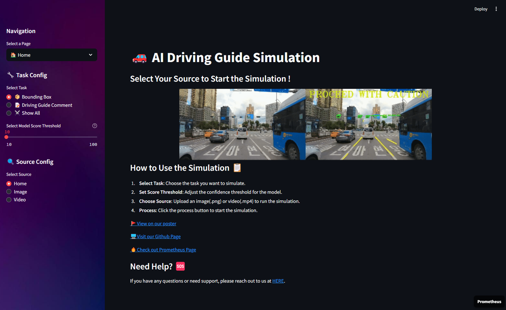
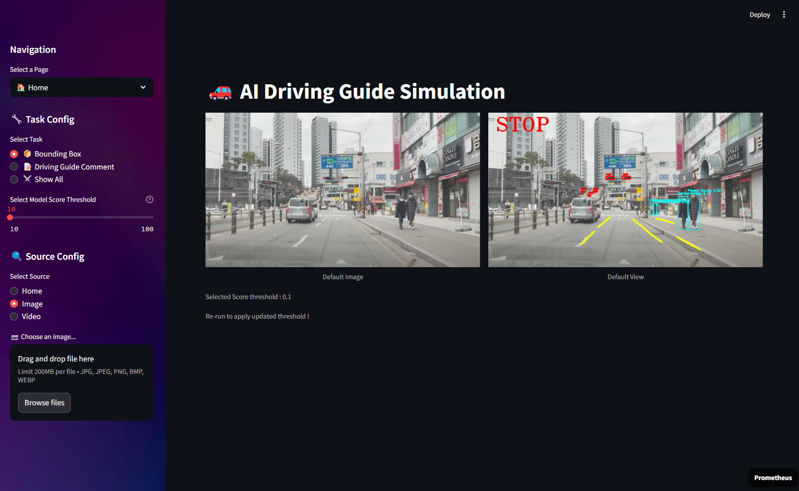
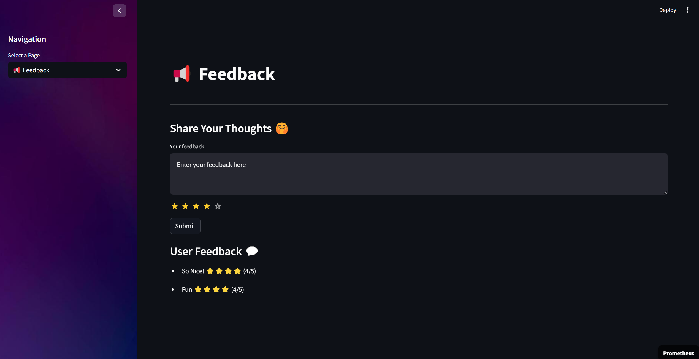

# Real-time Driving Guide AI with Object Detection and Instance Segmentation

This repository contains the codebase for the **AI Driving Guide project**, which provides driver guidance through *Object Detection* and *Instance Segmentation*. The project offers a user-friendly and customizable interface designed to detect and track pedestrians, traffic signs, and lanes in real-time video streams from various sources. For demonstration purposes, we use [Streamlit](https://streamlit.io/), a widely-used Python framework for developing interactive web applications.  
<br/>

<div align="center">
🛠 Tech Stack 🛠  
  
<br/>  


</div>

<br/> <br/>

## Overview

This README file provides a general introduction to the project. For detailed information about each detection task, please refer to the following README files linked :
- [Traffic Lights Detection README.md](https://github.com/lunash0/prometheus5_project_AIDrivingGuide/tree/feat/traffic_lights_detection/TrafficLights-Detection)
- [Pedestrian Detection README.md](https://github.com/lunash0/prometheus5_project_AIDrivingGuide/tree/feat/pedestrian_detection/Pedestrian-Detection)
- [Road Lane Detection README.md](https://github.com/lunash0/prometheus5_project_AIDrivingGuide/tree/feat/lane_detection/Lane-Detection)

<p align ="center">
<br/>
  
</p>

<br/><br/>

## Getting Started
### Requirements
Create a virtual environment and install dependencies:  
```
conda create -n aicar python=3.8
conda activate aicar
pip install torch torchvision
pip install tqdm
pip install matplotlib
pip install streamlit
```
## WebApp Demo on Streamlit 
You can look at our project through `http://localhost:8501/` in web browser.  
**NOTE** : Before you run the following command, please modify the model path in `configs/model.yaml`. 
```
streamlit run app/app.py
```
### 🏠 Home page for simulation
You can see the following initial screen.  


<br/><br/>

### Select and Upload your souce ➡️ Click Process Button and Wait ! 
In this section, users can upload the video they wish to analyze and watch as the model processes it. After selecting and uploading their source file, users click the Process button, initiating the AI model to analyze the video in real-time. The output, whether an image or video, will display detected objects like pedestrians, traffic lights, and lanes on the screen. This process is automated and designed for user convenience, providing real-time feedback.

Additionally, you can set your own score threshold.




### 💭 Feedback Page
Feel free to give feedback to our demo!
   


## Training
For fine-tuning the backbone, follow the bash file in `scripts/train.sh` :
```
cd ./models/Pedestrian_Detection/
python train.py \
    --mode train \
    --config_file configs/noHue_0.50.5_large_re_3.yaml \
    --OUTPUT_DIR ${OUTPUT_DIR}

cd ../Lane_Detection/
python train.py \
    --dataset ${DATASET_DIR}  \
    --pretrained ./model_weight/existing/best_model.pth

cd ../TrafficLights_Detection
python train.py  # Modify config.py for your configurations
```
You can also download each finetuned model url from here:
- [Pedestrian Detection](https://drive.google.com/file/d/10v2MYGYEH9h2a7KQS9HI1jGNG9QWBRC6/view?usp=drive_link)
- [TrafficLights Detection](https://drive.google.com/file/d/1yA3YCBp68J29G6osIzDu17igv3G3M2pM/view?usp=drive_link)
- [Lane Detection](https://drive.google.com/file/d/1ahltlZjJl-hdBRxf58jfbwFygS6bqIFB/view?usp=drive_link)

## Inference
For inference, instead of Webapp, you can directly run through the bash file in `scripts/inference.sh` which executes [inference.py](./inference.py).
```
python inference.py \
    --task_type all \
    --CFG_DIR configs/model.yaml \
    --OUTPUT_DIR test_video/kaggle_clip_all.mp4 \
    --video videos/kaggle_clip.mp4 \
    --ped_score_threshold 0.25 \
    --tl_score_threshold 0.4 &

python inference.py \
    --task_type message \
    --CFG_DIR configs/model.yaml \
    --OUTPUT_DIR test_video/kaggle_clip_message.mp4 \
    --video videos/kaggle_clip.mp4 \
    --ped_score_threshold 0.25 \
    --tl_score_threshold 0.4 
```
## Results
There are two types of results you can review:
- The first type shows the object detection results using bounding boxes for pedestrians and traffic lights and lines for lanes.
- The second type provides feedback, such as displaying 'Stop' on the screen when a stop sign is detected or 'Proceed with caution' when a pedestrian is nearby.

You can also see the results of applying both types simultaneously.  
<br/>

#### [Simulation Video 1] Left: Raw(nothing applied) | Right: Total View
The first simulation video shows the original video(left) and the total view(right).
<div align="center">
  
</div>
<br/>

#### [Simulation Video 2] Left : Comments Only | Right : Total View
The second simulation shows the results with feedback only(left) and the total view(right).
<div align="center">
  
</div>


<br/><br/>

## Directory Structure

```
prometheus5_project_AIDrivingGuide/
│
├── README.md         
├── play.py   
├── inference.py           
├── __init__.py      
│
├── engine/           
│   ├── models.py    
│   ├── utils.py       
│   └── __init__.py   
│
├── models/           
│   ├── TrafficLights_Detection/
│   ├── Pedestrian_Detection/
│   └── Lane_Detection/
│
├── scripts/           
│   ├── train.sh   
│   └── inference.sh   
│
├── configs/           
│   └── model.yaml     
│
├── assets/           
│   ├── feedback.json
│   └── ... 
│
└── app/              
    ├── app.py      
    ├── home.py      
    ├── feedback.py      
    ├── helper.py      
    ├── settings.py   
    ├── images/   
    └── videos/
```