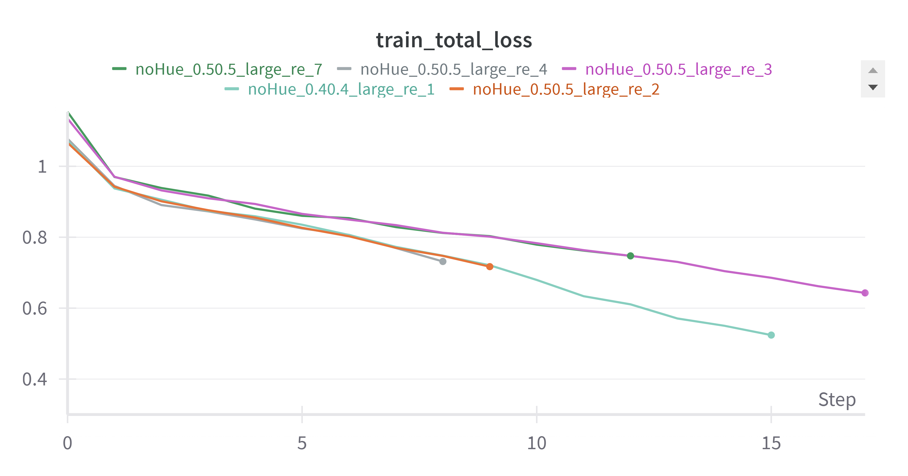
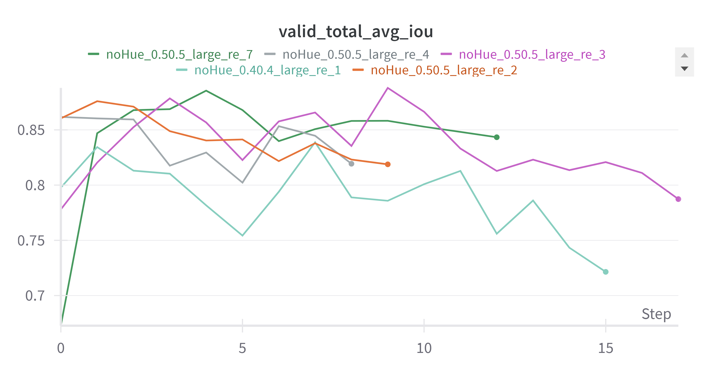
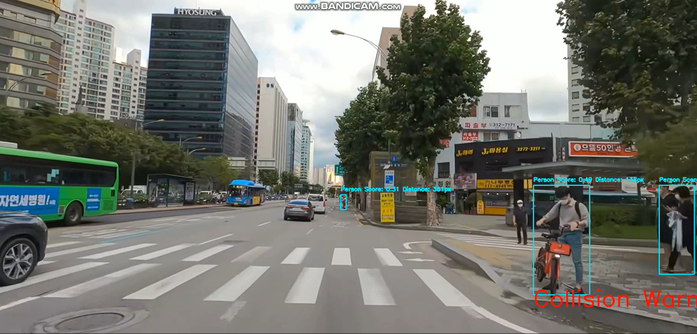
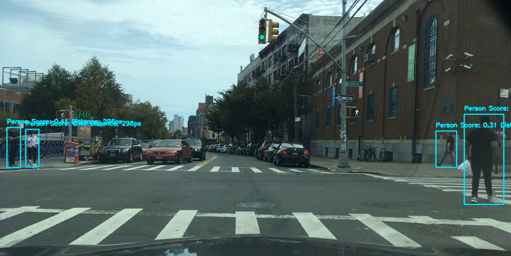
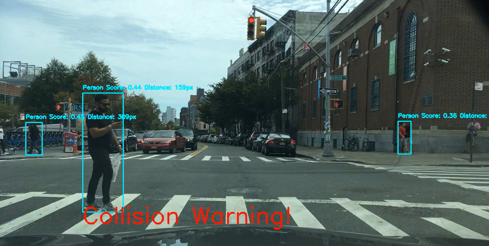

# AI Driving Guide project - Pedestrian Detection

<br>

> This README file provides information about pedestrian detection task. For detailed information about other detection tasks, please refer to the README files below: 
>   
> - [Traffic Lights Detection README.md](https://github.com/lunash0/prometheus5_project_AIDrivingGuide/blob/feat/traffic_lights_detection/README.md)
> - [Road Lane Detection README.md](https://github.com/lunash0/prometheus5_project_AIDrivingGuide/blob/feat/lane_detection/README.md)

<br>

<div align="center">
  <h2>🛠 Tech Stack of Project 🛠</h2>
  
  
  
  
  
</div>

<br>

# Pedestrian-Detection
This repository contains the codebase for the Pedestrian Detection component of our Driving Guidance Project.

<!-- ## Examples
 -->

## Getting Started
Clone this repository:  
``` 
git clone https://github.com/lunash0/prometheus5_project_AIDrivingGuide 
```
Create a virtual environment and install dependencies:
```
conda create -n pedestrian python=3.8
conda activate pedestrian
pip install -r requirements.txt
```

## Dataset
We fine-tuned a pretrained model using the [AI-HUB dataset](https://aihub.or.kr/aihubdata/data/view.do?currMenu=&topMenu=&aihubDataSe=data&dataSetSn=189).
 Specifically, we used the Bbox_13_new (9.69GB) and Bbox_19_new (9.87GB) datasets, totaling 19.56GB. The dataset is preprocessed into JSON files using  [preprocess.py](Pedestrian-Detection/preprocess.py), considering two classes, including `person` and `object(dog, cat)`.
- Number of training samples: 7847
- Number of test samples: 3341

## Training models
We provide a script in `scripts/train.py`, for training with various configurations provided in the pedestrian-detection model. You may use it as a reference to write your own training script.

1. **Setup Configurations**:
   Edit the configuration file in [configs/configs.yaml](Pedestrian-Detection/configs/configs.yaml) to match your requirements.
2. **Run Training Script**:
   Execute the following command to start training:

    ```
    python train.py \
        --mode train \
        --config_file configs/noHue_0.50.5_large_re_4.yaml \
        --OUTPUT_DIR /home/yoojinoh/Others/PR/data/outputs #YOUR LOCAL PATH
    ```
    Alternatively, you can use the convenience script [scripts/train.sh](Pedestrian-Detection/scripts/train.sh) to run the training.

## Inference
1. **Setup Configurations**:
   To test a model with "test.py", first setup the corresponding configs through [configs/configs.yaml](Pedestrian-Detection/configs/configs.yaml)

2. **Run Testing Script**:
   Execute the following command to start testing:

    ```
    python test.py \
        --mode test \
        --config_file configs/noHue_0.50.5_large_re_4.yaml \
        --model /home/yoojinoh/Others/PR/data/outputs/ \ #YOUR LOCAL PATH
        --OUTPUT_DIR /home/yoojinoh/Others/PR/data/outputs #YOUR LOCAL PATH
    ```
    Alternatively, you can use the convenience script [scripts/test.sh](Pedestrian-Detection/scripts/test.sh) to run the testing.

## Results
### 1) Training and Validation Logs
We use `wandb` for visualizing training and validation metrics. Below are the plots showing the metrics logged during training and validation.

<table>
  <tr>
    <td>
      
    </td>
    <td>
      
    </td>
  </tr>
</table>

### 2) Quantitative Results on AI-HUB Dataset
All models are fine-tuned on the pre-trained model, `retinanet_resnet50_fpn`.
RetinaNet with ResNet50 FPN has demonstrated superior performance in our object detection tasks, particularly in detecting smaller objects. Our multiple experiments have shown that it performs better compared to Faster R-CNN with ResNet50 FPN.


| Model_Name                  | Epochs | Best Epoch | Train Loss | IoU  |
|-----------------------------|--------|------------|------------|------|
| noHue_0.40.4_large_re_1     | 16     | 8          | **0.773**      | 0.839|
| noHue_0.50.5_large_re_2     | 10     | 8          | **0.773**      | 0.839|
| noHue_0.50.5_large_re_3     | 18     | 10         | 0.802      | **0.888**|
| noHue_0.50.5_large_re_4     | 9      | 1          | 1.078      | 0.862|
| noHue_0.50.5_large_re_7     | 13     | 10         | 0.881      | 0.886|

### 3) Testing On Real-time video
We used `noHue_0.50.5_large_re_3` as our model for the best validation IoU score. 





## Configurations Structure
```
train:
  batch_size: 
  seed: 
  image_size:
  num_classes: 
  learning_rate: 
  scheduler: 
  optimizer: 
  epochs: 
  model_name: 
  iou_threshold: 
  confidence_threshold:
  device: 
  early_stop: 
  early_stop_patience: 

log:
  project: 
  entity: 

test:
  input_video_path: 
  num_classes: 
  score_threshold: 
  iou_threshold: 
  confidence_threshold:
  device: 
  warning_distance: 
  
```

## Directory Structure
```
Pedestrian-Detection/
│
├── configs/
│ ├── configs.yaml 
│ ├── noHue_0.50.5_large_re_4.yaml 
│ └── ... 
│
├── data/
│ ├── outputs/ 
│ └── ...
│
├── results/
│ ├── wandb_meanf_train_.png 
│ ├── wandb_meanf_val.png 
│ └── ... 
│
├── scripts/
│ ├── train.sh 
│ └── test.sh
│
├── __init__.py 
├── README.md 
├── dataset.py 
├── engine.py 
├── model.py 
├── preprocess.py
├── train.py
├── test.py 
├── utils.py 
└── requirements.txt        
```

> Pedestrian-Detection task is done by [Minji Kim](https://github.com/minji1289) and [Yoojin Oh](https://github.com/finallyupper). 
