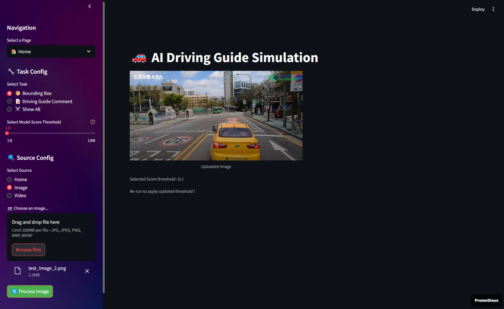

# Real-time Driving Guide AI with Object Detection and Instance Segmentation

This repository contains the codebase for the **AI Driving Guide project**, which provides driver guidance through *Object Detection* and *Instance Segmentation*. The project offers a user-friendly and customizable interface designed to detect and track pedestrians, traffic signs, and lanes in real-time video streams from various sources. For demonstration purposes, we use [Streamlit](https://streamlit.io/), a widely-used Python framework for developing interactive web applications.

## Overview
This README file provides a general introduction to the project. For detailed information about each detection task, please refer to the following README files linked :
- [Traffic Lights Detection README.md](https://github.com/lunash0/prometheus5_project_AIDrivingGuide/tree/feat/traffic_lights_detection/TrafficLights-Detection)
- [Pedestrian Detection README.md](https://github.com/lunash0/prometheus5_project_AIDrivingGuide/tree/feat/pedestrian_detection/Pedestrian-Detection)
- [Road Lane Detection README.md](https://github.com/lunash0/prometheus5_project_AIDrivingGuide/tree/feat/lane_detection/Lane-Detection)

<p align ="center">
  
</p>


<center> 🛠 Tech Stack 🛠  
<br></br> 


</center>


## Getting Started
### Requirements
```
pip install streamlit
```
### WebApp Demo on Streamlit 
**NOTE** : Before you run the following command, please modify the model path in `configs/model.yaml`. 
```
streamlit run app/app.py
```
### 🏠 Home page


### Select and Upload your souce ➡️ Click Process Button and Wait ! 


## Training
For fine-tuning the backbone, follow the bash file in `scripts/train.sh` :
```
cd ./models/Pedestrian_Detection/
python train.py \
    --mode train \
    --config_file configs/noHue_0.50.5_large_re_3.yaml \
    --OUTPUT_DIR ${OUTPUT_DIR}

cd ../Lane_Detection/
python train.py \
    --dataset ${DATASET_DIR}  \
    --pretrained ./model_weight/existing/best_model.pth

cd ../TrafficLights_Detection
python train.py  # Modify config.py for your configurations
```
You can also download each finetuned model url from here:
- [Pedestrian Detection](https://drive.google.com/file/d/10v2MYGYEH9h2a7KQS9HI1jGNG9QWBRC6/view?usp=drive_link)
- [TrafficLights Detection](https://drive.google.com/file/d/1yA3YCBp68J29G6osIzDu17igv3G3M2pM/view?usp=drive_link)
- [Lane Detection](https://drive.google.com/file/d/1ahltlZjJl-hdBRxf58jfbwFygS6bqIFB/view?usp=drive_link)

## Results
#### Total View
<div align="center">
  
</div>

#### Left : Comments Only | Right : Total View
<div align="center">
  
</div>


## Directory Structure

```
prometheus5_project_AIDrivingGuide/
│
├── README.md         
├── play.py           
├── __init__.py      
│
├── engine/           
│   ├── models.py    
│   ├── utils.py       
│   └── __init__.py   
│
├── models/           
│   ├── TrafficLights_Detection/
│   ├── Pedestrian_Detection/
│   └── Lane_Detection/
│
├── scripts/           
│   ├── train.sh   
│   └── inference.sh   
│
├── configs/           
│   └── model.yaml     
│
├── assets/           
│   ├── image_bbox_input_demo.png
│   ├── home_demo.png
│   └── ... 
│
└── app/              
    ├── app.py      
    ├── settings.py   
    └── assets/       
        ├── videos/
        └── images/
```
  <br><br><br><br><br><br>

# TO-DO
- [x] Merge Pedestrian-Detection
- [x] Merge Traffic-Lights-Detection
    - [x] Fix Detecting Color of Light Issue
- [x] Merge Lane-Detection
    - [x] Develop messeage printing algorithms (for non RGB cases, considering score using threshold, etc.)
- [x] Add Image Output version
    - [x] Fix image/video input coexistence issue
- [x] Connect Streamlit
- [] Improve infernce time
  - [] Change Lane detection (Merging) Algorithm
- [] Refactor (Hard coded, comments, path, stremlit statistics page)

